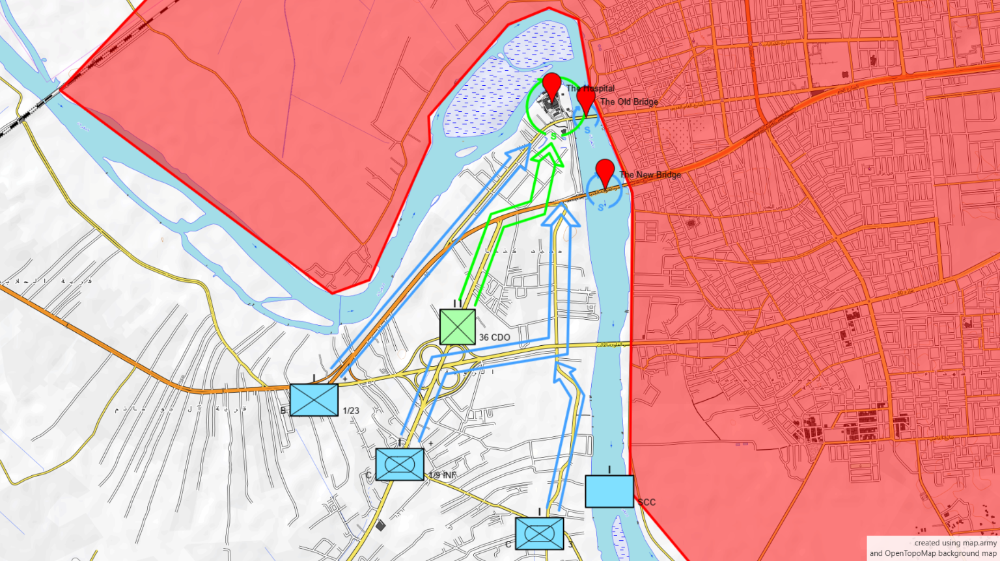

# Isolation
Phase I \
1900 - November 7, 2004 \
Fallujah, al-Anbar Governorate, Iraq

## Units Structure
- Task Force **Wolfpack**:
    - :heavy_check_mark: Company **C**, **3**rd **L**ight **A**rmored **R**econnaissance Battalion
    - :heavy_check_mark: (reinforced) Company **B**, **1**st Battalion, **23**rd Marines
    - :heavy_check_mark: (reinforced mechanized infantry) Company **C**, **1**st Battalion, **9**th Infantry
    - :x: **S**mall **C**raft **C**ompany, **2**nd Marine Division
- :heavy_check_mark: **Iraqi** **36**th **C**omman**do** Battalion

## Tasks
- :heavy_check_mark: Secure the **two** key **bridges**.
- :heavy_check_mark: Secure the **hospital**.
- :heavy_check_mark: Secure the **506th Iraqi National Guard compound**.

## Report
- Operation initiated at **1900** on **November 7, 2004**:
    - :x: Marines launched precision **air strikes** on:
        - **defensive positions**
        - **weapons caches**
        - **command and control centers**.
    - :x: Covering fire by:
        - **155mm howitzers** of Battery **M**, **4**th Battalion, **14**th Marines
        - Battery **C**, **1**st Battalion, **12**th Marines
        - self-propelled **M109A6 Paladins** from Battery **A**, **3**rd Battalion, **82**nd Field Artillery
- **B/1/23** moved up the peninsula’s **western side** along the river and Main Supply Route Michigan.
- :heavy_check_mark: **C/3 LAR** moved up the peninsula’s **eastern side**.
- :heavy_check_mark: The **soldiers**, **tanks**, and **Bradleys** from **C/1/9 INF**, and a platoon from **B/1/23**, proceeded up the **center** of the peninsula **toward the two bridges**.
- :heavy_check_mark: **36 CDO** moved toward the **hospital**.
- :x: Within **five minutes** after crossing the line of departure, **Cpt. Conway**'s **LAV** struck an **IED**.
- :x: **Conway and his Marines** came **under** enemy **fire** and received **shrapnel** from **friendly air and artillery missions**.
- **2100**: All **bridges** **secured**.
- **2300**: **36 CDO** **seized** the Fallujah **hospital** with **no resistance**.
- **0140** on **Nov**ember **8**: All objectives secured.
- :x: **SCC** drifted around the tip of the peninsula encountered **fire** from insurgents in the **Jolan District**.
